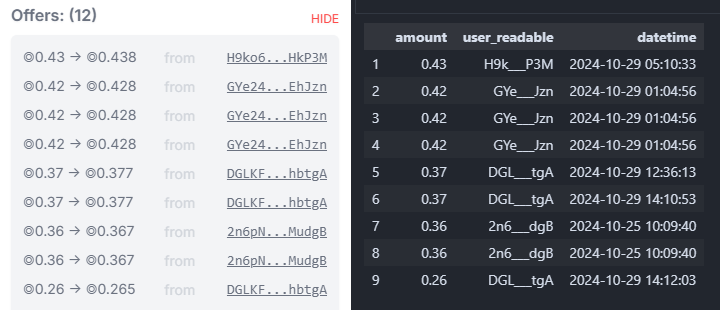

# Solana Data Analytics
## **Requirements**

Virtual Environment with Python 3.11 

[How to create virtual environments for python with conda](https://numdifftools.readthedocs.io/en/stable/how-to/create_virtual_env_with_conda.html)

## Sharky Loan Offers 
Sharky.fi is a Solana-based lending and borrowing protocol that uses NFTs as collateral. The 'sharky-loan-offers.ipynb' file in this repository procures pending offered loans by querying live blockchain data. 

[Visualize Sharky loan data on their website](https://sharky.fi/beta/orderbooks)

**Offered loans data of the 'Play Solana NFT' collection compared to the results in the jupyter notebook**

Note: The time between api calls can be reduced to less then a second when working with a private rpc provider.

