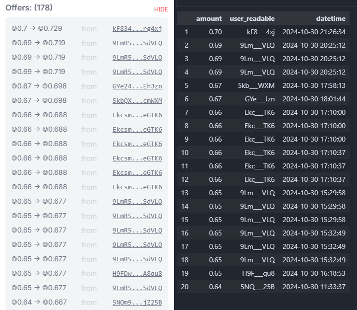

# Solana Data Analytics
## **Requirements**

Virtual Environment with Python 3.11 

[How to create virtual environments for python with conda](https://numdifftools.readthedocs.io/en/stable/how-to/create_virtual_env_with_conda.html)

## Sharky Loan Offers 
Sharky.fi is a Solana-based lending and borrowing protocol that uses NFTs as collateral. The Jupyter notebook files in this repository procure pending offered loans by querying live blockchain data. 

[Visualize Sharky loan data on their website](https://sharky.fi/beta/orderbooks)

 

**Offered loans for the 'Play Solana NFT' collection compared to the results in 'sharky-loan-offers.ipynb'**

 

**Offered loans for the 'Sharx' collection with a 16 day duration compared to the results in 'sharky-loan-offers-2.ipynb'**

