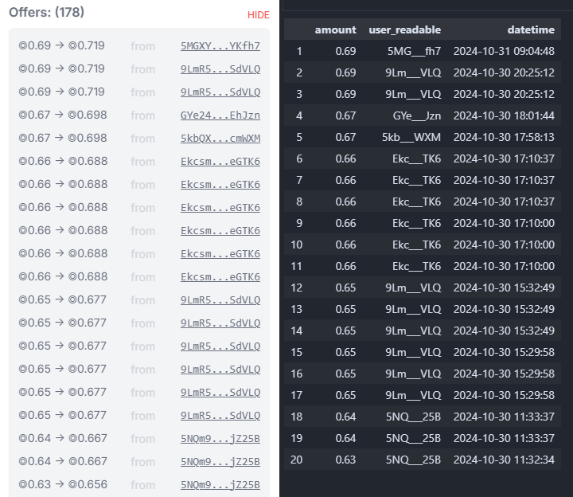
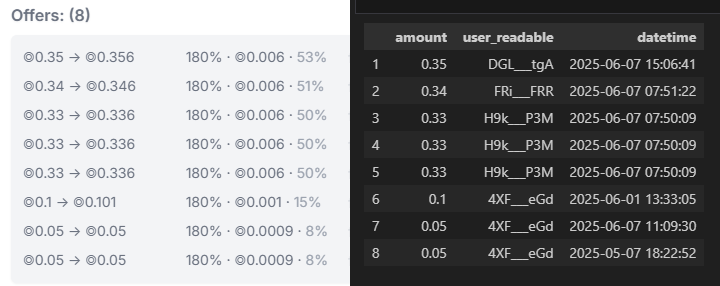

# Solana Data Analytics
## **Requirements**

Virtual Environment with Python 3.11 for Jupyter Notebook (.ipynb)

[How to create virtual environments for python with conda](https://numdifftools.readthedocs.io/en/stable/how-to/create_virtual_env_with_conda.html)

Flipside account with the free plan or higher for SQL query (.sql) and there can be a short latency for the SQL database.

[Flipside Studio](https://flipsidecrypto.xyz/studio/)

## Sharky Loan Offers 
Sharky.fi is a Solana-based lending and borrowing protocol that uses NFTs as collateral. The Jupyter notebook files in this repository procure pending offered loans by querying live blockchain data. 

[Visualize Sharky loan data on their website](https://sharky.fi/beta/orderbooks)

 

**Offered loans for the 'Play Solana NFT' collection compared to the results in 'sharky-loan-offers-1.ipynb'**

 

**Offered loans for the 'Sharx' collection with a 16 day duration compared to the results in 'sharky-loan-offers-2.ipynb'**

 

**Offered loans for the 'Leveraged Labs' collection with a 7 day duration compared to the results of 'sharky-loan-offers.sql' in Flipside Studio**

 

**Offered loans for the 'Sr Manzano' collection with a 7 day duration compared to the results in 'sharky-loan-offers-3.ipynb'**

 

**Loans of the 'Sr Manzano' collection expiring within 36 hours compared to the results in 'sharky-loans-1.ipynb'**

 
